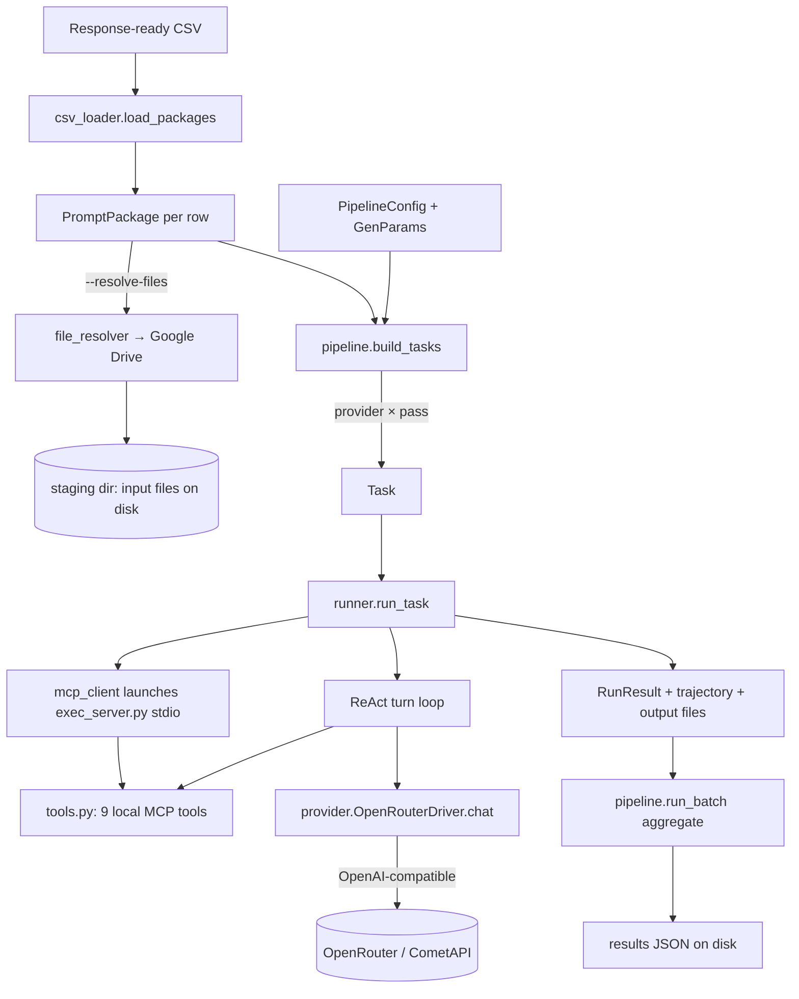

# DRA Response-Generation Harness (`dra_harness`)

The harness takes a **response-ready CSV** of tasks, runs each task through one or
more models as a real multi-turn agent (ReAct loop with local tools), and writes
the models' deliverables plus a full trajectory to disk. It is the "Response
Generation" stage of the wider DRA pipeline: it consumes sealed prompts +
Drive-hosted input files and produces the candidate/reference responses that the
scorer later grades against the golden.

Every model is reached through the **OpenAI-compatible** Chat Completions API, so
one driver serves all of them — only the model slug (and, for CometAPI, the
base URL/key) changes.

---

## 1. Data flow



Component-to-file map:

| Block | File |
|---|---|
| CSV loading, column aliasing, output-format detection | `csv_loader.py` |
| Drive fetch (folders/files → local staging) | `file_resolver.py` |
| Fan-out, orchestration, aggregation, results JSON | `pipeline.py` |
| Config knobs (`PipelineConfig`, `GenParams`) | `config.py` |
| Data structures (`Task`, `RunResult`, `TurnRecord`) | `models.py` |
| ReAct loop, message building, output harvest | `runner.py` |
| One unified model driver | `provider.py` |
| MCP client (starts the tool server over stdio) | `mcp_client.py` |
| MCP tool server (FastMCP, thin wrappers) | `exec_server.py` |
| The actual tool implementations + registry | `tools.py` |
| Deliverable post-processing (md→docx, prefixing) | `file_gen.py` / `runner.py` |

---

## 2. The model registry (`provider.py`)

`MODEL_REGISTRY` is keyed **per model** (not per vendor), so two models from the
same vendor can run in one batch. Each entry is a dict; the driver reads only
`slug`, `base_url` (default OpenRouter), `api_key_env` (default
`OPENROUTER_API_KEY`), and `supports_tools`. Any other keys are ignored by the
driver and free to use as documentation.

Current validated set (all via OpenRouter unless noted):

| Key | Slug | Notes |
|---|---|---|
| `opus5` | `anthropic/claude-opus-5` | reasoning on by default |
| `gpt56_sol` | `openai/gpt-5.6-sol` | 1.05M ctx / 128K out |
| `gemini31_pro` | `google/gemini-3.1-pro-preview` | only exists as `-preview` |
| `grok46` | `x-ai/grok-4.6` | |
| `gpt56_terra` | `openai/gpt-5.6-terra` | |
| `sonnet` | `anthropic/claude-sonnet-5` | reasoning on by default |
| `deepseek_v4_flash` | `deepseek/deepseek-v4-flash` | |
| `kimi_k3` | `moonshotai/kimi-k3` | **`moonshotai/` not `moonshot/`** (404 trap) |
| `glm52` | `z-ai/glm-5.2` | |
| `qwen27b` | `qwen/qwen3.6-27b` | **use this Qwen** (see warning) |
| `hunyuan` | `tencent/hy3` | reference (Model_A) |
| `doubao` | `doubao-seed-2-1-pro-260628` | reference (Model_B), via **CometAPI** |
| `claude`/`openai`/`gemini` | (aliases) | point at the current tier |

> **Qwen warning.** `qwen/qwen3.6-35b-a3b` (the MoE "a3b" variant) does **not**
> drive the agentic loop — in testing it answered in a single turn, called zero
> tools, and fabricated a generic report instead of reading the inputs. Use
> **`qwen/qwen3.6-27b`** (`qwen27b`), which was validated end-to-end (multi-turn,
> all tools, correct file-derived output). Keep `qwen27b` at **temperature 0.3**
> (see overrides) — Qwen is non-functional at 1.0 for agentic tasks.

**Reference vs candidate:** `hunyuan`/`doubao` are the fixed reference generators
(Model_A / Model_B for the golden). Run them in a **separate** batch from the
candidate models, not mixed into a candidate sweep.

**Adding/swapping a model** is a one-line registry edit. Cost/latency knobs do
NOT live here — they go in `config.agent_overrides` so re-baselining is a config
change, not a code change.

---

## 3. The driver (`provider.OpenRouterDriver`)

One async wrapper over the OpenAI-compatible endpoint, reused across all
providers (connection pooling). `chat()` builds the request (messages, tools,
temperature, `max_tokens`, `reasoning_effort`), calls the endpoint, retries
transient errors (429/5xx/timeout) up to `max_retries`, and returns a normalized
`ChatResponse` (text, tool_calls, citations, tokens, cost, finish_reason).

### Robust text extraction (`_extract_text`)

Different providers return the assistant's visible text in different shapes.
`_extract_text(msg)` handles all three:

1. **Plain string** `content` (OpenAI, Anthropic) — used directly.
2. **List-of-parts** `content` (`[{type:'text', text:...}]`, e.g. Gemini) —
   text parts concatenated.
3. **Empty `content` + reasoning field** (`reasoning` / `reasoning_content`) —
   thinking models (DeepSeek, GLM, Kimi, Qwen, Gemini with `reasoning_effort`)
   sometimes put the visible answer in the reasoning field with `content` empty.
   Falls back to it, but **only when `content` is genuinely empty**, so a real
   answer is never overwritten by the thinking trace.

This is applied in **both** `_normalize` (the returned text) and
`_assistant_message_dict` (the message appended to history) — the latter matters
because dropping the text from history breaks the *next* turn of a multi-turn
loop. Without this fix, thinking models returned empty responses (nonzero output
tokens but `text == ""`) and stalled the loop.

---

## 4. MCP tool server (`exec_server.py` + `tools.py`)

Tools are **local MCP tools**, provider-agnostic: every model gets the same
toolset regardless of endpoint (OpenRouter, CometAPI, or a direct vendor API).

- `mcp_client.py` launches `exec_server.py` as a **stdio subprocess** scoped to
  the run's staging dir (`DRA_AGENT_WORKDIR`), lists its tools, and converts them
  to OpenAI tool schemas that are passed to the model.
- `exec_server.py` holds no logic — it is thin `@mcp.tool()` wrappers that
  delegate to `tools.execute(name, args)`. A startup parity check fails loud if
  `tools.py` has a tool with no wrapper here.
- `tools.py` is the single source of truth: every tool is a `@register_tool`
  entry in `TOOL_REGISTRY`.

### The nine tools

`python_execute`, `bash_execute`, `read_file`, `write_file`, `list_directory`,
`search_in_file`, `web_search`, `web_fetch`, `calculator`.

### `web_search` — Serper primary, DuckDuckGo fallback

`web_search` is a **local tool** (NOT OpenRouter's web plugin). Routing:

- If `SERPER_API_KEY` is set → **Serper** (Google results via
  `https://google.serper.dev/search`). Far better on institutional / government /
  data sources.
- On missing key, empty Serper result, or any Serper error → **DuckDuckGo**
  fallback. Every fallback is **logged** (`dra.tools`) so a Serper outage is
  visible rather than silently degrading search quality.

`SERPER_API_KEY` lives in `.env`; `config.load_env()` loads it into the
environment at pipeline start, and `mcp_client` passes the full environment to
the exec_server subprocess, so the key reaches the tool.

> **Do NOT enable `params.web_search` (`--web-search`).** That flag attaches
> OpenRouter's *own* web plugin on top of the local `web_search` tool. Some
> providers (xAI/Grok) reject the collision with `400 Duplicate tool names:
> web_search`, and it is redundant for everyone else. The local Serper tool
> already gives every model web search. Leave `web_search` off (it defaults off).

### `search_in_file` — lossless search, bounded output

`search_in_file` extracts the whole file (`max_chars=0`) and searches all of it,
then caps only the **returned matches** at ~15,000 characters. This matters for
large PDFs: an earlier version inherited `read_file`'s 100,000-char cap and so
silently searched only the first ~30–50 pages of a big document, returning "no
matches" for data that was actually there. Now it finds deep matches; when there
are more matches than fit, it keeps whole matches up to the cap and appends an
explicit `[... N more match(es) not shown ...]` note instead of a silent cut.

---

## 5. The ReAct loop (`runner.run_task`)

### Message construction (`build_messages`)

The model gets a fixed system prompt — deep-research analyst, cite non-trivial
claims, don't fabricate sources — plus the operational rule that **matters for
file output**:

> "All input files are in your current working directory. Write every output file
> to the current working directory using a plain filename — do not use absolute
> paths and do not 'cd' elsewhere, or your files will be lost between steps."

Input files are **on disk in the run folder, not inlined** into the prompt — the
model discovers them via `list_directory` / `read_file`. This is why
`--resolve-files` is load-bearing: no resolved files means the model has nothing
to read.

### The loop

Per `Task`: stage input files (symlinked into the run folder), build messages,
launch the MCP server, then loop `for turn in range(1, params.max_turns + 1)`:

1. Call the driver (`OpenRouterDriver.chat`) with messages + tool schemas.
2. **Budget check** — if accumulated cost exceeds `params.max_cost_usd`, set
   `forced_stop=True` and break.
3. If the model returned **no tool calls** (or tools disabled), the turn's text is
   the **final answer** — break.
4. Otherwise execute each tool call via the MCP client, append results to the
   messages, record the turn, continue.

If the loop reaches `max_turns` still calling tools, it ends `forced_stop=True`
(last text kept). Every turn — assistant text, tool calls, tool results, tokens,
cost — is appended to the **trajectory**, the primary observability artifact
(it's what you read to see whether a model actually used the tools or shortcut
them).

### What "completed" actually means

`completed` is stricter than "the loop ended." From the real logic:

```python
completed = (
    bool(final_text)                        # produced some final text
    and not output_file_errors              # no file-generation error
    and (produced_file or not demands_file) # if a file was demanded, it exists
    and (not forced_stop or produced_file)  # if force-stopped, it at least made a file
)
```

A run that hit the turn cap or the budget can still be `completed` **if it
produced the demanded deliverable**; a run that returned text but failed to write
a required file is **not** completed. `RunResult` carries `forced_stop`
separately, so a clean finish is distinguishable from a capped one.

> **`completed=True` is NOT a quality signal.** It means the mechanics succeeded
> (text + required file, no file errors) — not that the content is correct. A
> model can complete-and-fabricate (observed with `qwen3.6-35b-a3b`:
> `completed=True`, a docx written, content pure boilerplate, zero tools called,
> inputs never read). Always read the trajectory (did it call
> `read_file`/`python_execute`?) and the deliverable content before trusting a run.

### Output harvest & post-processing

`_harvest_output_files` collects genuine model-generated files from the staging
dir (input symlinks skipped, transient `.py` scripts filtered). It runs
**regardless of `file_output` or `forced_stop`**, so a run that hit the turn cap
after writing its deliverable keeps it. `_postprocess_outputs` converts md→docx
where needed, renders the response into a docx, and **prefixes every output with
the provider name** (`opus5_answer.docx`) so parallel runs don't collide. Final
paths land in `RunResult.output_files`.

> A deliverable is usually NOT literally `answer.md` — it's renamed/prefixed.
> Check `RunResult.output_files` (or glob `*_answer.docx` / `*_response.docx` in
> the run folder), not a hardcoded name.

---

## 6. Config (`config.py`)

`GenParams` defaults include `temperature=1.0`, `max_tokens=32000`,
`reasoning_effort="high"`, `max_turns=250`, `web_search=False`,
`max_cost_usd=50.0`. `PipelineConfig.params_for(provider)` returns the defaults
merged with any per-provider `agent_overrides`.

Current `agent_overrides`:

```python
{
  "qwen":       {"temperature": 0.3},
  "qwen27b":    {"temperature": 0.3},   # named entry needs its own override
  "opus5":      {"reasoning_effort": "medium"},
  "sonnet":     {"reasoning_effort": "medium"},
  "gpt56_sol":  {"reasoning_effort": "medium", "max_tokens": 64000},
  "gpt56_terra":{"reasoning_effort": "medium"},
}
```

> **Override keying gotcha.** `agent_overrides` is keyed by the exact provider
> name. If you name the registry entry `qwen27b`, an override keyed `"qwen"` will
> NOT reach it — add `"qwen27b": {"temperature": 0.3}` explicitly. Verify with:
> `python -c "from dra_harness.config import PipelineConfig; print(PipelineConfig().params_for('qwen27b').temperature)"` → must print `0.3`.

---

## 7. CLI

```
python -m dra_harness --csv CSV [options]
```

| Flag | Meaning |
|---|---|
| `--csv` | Response-ready CSV (required) |
| `--providers ...` | Space-separated provider names (default: the candidate set) |
| `--passes N` | Passes per provider (K-passes for variance) |
| `--max-rows N` | Cap number of CSV rows |
| `--task-ids ID,ID` | Run only these task ids (comma-separated) |
| `--live` | **Make real API calls.** Default is dry-run (no cost, mock results) |
| `--resolve-files` | **Download the Drive links** to local staging before running |
| `--web-search` | Attach OpenRouter web plugin — **leave OFF** (collides with local tool) |
| `--max-turns N` | Override loop ceiling |
| `--temperature`, `--max-tokens`, `--timeout` | GenParams overrides |
| `--max-cost N` | Hard USD ceiling per run (safety net) |
| `--concurrency N` | Concurrent runs (default 4) |
| `--model p=slug ...` | Per-provider slug override |
| `--tools ...` | Restrict to named tools |
| `--no-file-output` | Skip deliverable generation |
| `--output-dir` / `--staging-dir` | Override output locations |
| `--no-save` | Don't write the results JSON |
| `--verbose` / `-v` | Debug logging (shows tool calls, file resolution) |

Two flags are load-bearing for a real run: **`--live`** (else it's a dry run) and
**`--resolve-files`** (else the model gets the prompt but not the input files and
generates blind).

---

## 8. Output layout

```
runs_dir/
└── run_<UTC-timestamp>_<providers>/
    ├── run_<...>_<N>tasks.json           # results JSON (trajectories, cost, summary)
    └── staging/
        ├── <shared input downloads>       # Drive files, downloaded once
        └── <task_id>/
            └── runs/
                ├── <provider>__p1/         # per provider+pass workspace
                │   ├── <input files>
                │   └── <provider>_answer.docx   ← the deliverable
                └── ...
```

The results JSON records, per run: `provider`, `model`, `turns`, `completed`,
`forced_stop`, `error`, `tool_calls`/`trajectory`, token counts, `total_cost_usd`,
and `output_files`.

---

## 9. Requirements & setup

```bash
# env (Mac: conda env `dra` / py3.11; spark server: conda env `adobe` / py3.10)
pip install openai fastmcp duckduckgo-search python-dotenv \
            python-docx openpyxl pdfplumber requests --break-system-packages

# .env at repo root — the keys the harness reads
OPENROUTER_API_KEY=...     # all OpenRouter models
SERPER_API_KEY=...         # web_search (Serper primary; else DuckDuckGo)
COMETAPI_KEY=...           # only for doubao
# (ANTHROPIC_API_KEY / OPENAI_API_KEY / GOOGLE_API_KEY optional; direct routing
#  is possible via a per-model base_url but is not the default — everything runs
#  through OpenRouter for uniform tooling.)
```

### Smoke tests (run these before any paid batch)

```bash
python test_models.py --all            # one tiny real call per model → slug/key OK
python test_harness_tools.py opus5     # one model end-to-end through the real loop
python test_web_search.py              # Serper primary + DDG fallback (real calls)
python test_pdf_search.py              # search_in_file finds deep matches in a big PDF
```

`test_harness_tools.py` runs a real task through `run_task` and checks the model
took >1 turn, called the tools, and wrote a deliverable. **Passing means the
plumbing works — it does NOT prove the deliverable content is correct.** Always
read at least one produced `*_answer.docx` and confirm it contains real,
file-derived values (not fabricated boilerplate) before trusting a model.

### Running real tasks

```bash
# dry run first (free) — confirm CSV loads, files resolve to staging, tasks build
python -m dra_harness --csv ./SME_data/<file>.csv --task-ids <id> \
  --providers opus5 gemini31_pro gpt56_sol qwen27b --resolve-files --verbose

# then add --live (and a cost ceiling)
python -m dra_harness --csv ./SME_data/<file>.csv --task-ids <id> \
  --providers opus5 gemini31_pro gpt56_sol qwen27b \
  --live --resolve-files --max-cost 40 --verbose
```

Confirm Drive files actually landed before going live:

```bash
find ./runs_dir/run_<ts>_* -name "*.xlsx" -o -name "*.pdf" -o -name "*.docx"
```

---

## 10. Troubleshooting (real failure modes)

These are the failures actually hit while bringing the harness up, and how each
was diagnosed and fixed — check here first when something misbehaves.

| Symptom | Cause | Fix |
|---|---|---|
| A model returns **empty text** but nonzero output tokens (e.g. `test_models.py` shows `out=13` but text is blank) | Thinking model put its answer in `reasoning`/`reasoning_content`, or content came as a list of parts; the driver read `content` only | `_extract_text` (see §3). Affects Gemini, DeepSeek, GLM, Kimi, Qwen. |
| Multi-turn loop **stalls after turn 1** for a thinking model even though the first answer was captured | `_assistant_message_dict` dropped the text from history (same content-only bug), so the next turn saw an empty assistant message | `_extract_text` is applied in `_assistant_message_dict` too, not just `_normalize`. |
| **`400 Duplicate tool names: web_search`** (xAI/Grok, sometimes others) | `params.web_search=True` attached OpenRouter's web plugin *on top of* the local `web_search` MCP tool → two tools named `web_search` | Leave `web_search` off (`--web-search` OFF). The local Serper tool already gives web search. |
| `web_search` returns weak/no results on institutional/gov queries | Serper not wired (running DDG-only), or `SERPER_API_KEY` not loaded | Confirm the deployed `tools.py` has the Serper `_web_search`; confirm `SERPER_API_KEY` in `.env`; `test_web_search.py`. |
| DDG fallback errors with `SelectedUnofferedKxGroup` (TLS) | DuckDuckGo/Bing TLS handshake failing on the host | Serper-primary means this rarely matters; it's a host networking issue, not the harness. |
| `search_in_file` reports **"no matches"** for data you know is in a large PDF | Old version truncated to 100K chars before searching (first ~30–50 pages only) | Lossless `search_in_file` (see §4) — searches the whole file, bounds only the output. |
| A model shows **`turns=1`, zero tools, `completed=True`, a docx written** — but the docx is generic boilerplate | Model didn't emit tool calls (narrated intent as prose), fabricated a report; the harness wrapped its response into a docx | Model-capability failure, not a harness bug. `qwen3.6-35b-a3b` does this — use `qwen27b`. Read the deliverable content, don't trust the flags. |
| Qwen runs at temp 1.0 despite an override | Override keyed `"qwen"` doesn't reach a registry entry named `qwen27b` | Add `"qwen27b": {"temperature": 0.3}` to `agent_overrides`; verify via `params_for('qwen27b').temperature`. |
| Dry run shows `file_paths: None` for every provider | Dry-run doesn't attach staged files to tasks — but the **download still happens** | Confirm on disk: `find ./runs_dir/run_<ts>_* -name "*.xlsx" -o -name "*.pdf"`. Files present = resolution worked. |
| `[error] duckduckgo-search not installed` on the wrong env | Ran in the wrong conda env | Mac = `dra` (py3.11); spark server = `adobe` (py3.10). Activate the right one. |
| Repo file behaves differently than expected | The GitHub/repo checkout lagged the server's deployed code during development | Trust the **deployed** `tools.py`/`provider.py` on the server; reconcile repo → server (see §10.1). |

### 10.1 State of the repo vs. this doc

This document describes the **corrected** harness (Serper `web_search`,
`_extract_text` reasoning fix, lossless `search_in_file`, `qwen27b`, per-model
overrides). If a checkout still shows a DuckDuckGo-only `web_search`, a
content-only `_normalize`, or `qwen/qwen3.6-35b-a3b`, that tree is **behind** the
validated server state — reconcile before running. (The public
`dra-response-gen@dra-harness-mcp` branch lagged the server during development;
confirm the deployed `tools.py`/`provider.py` match this doc.)